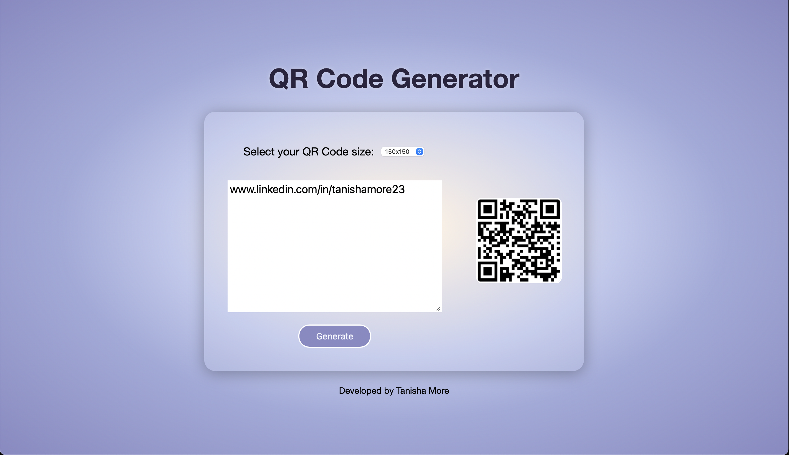
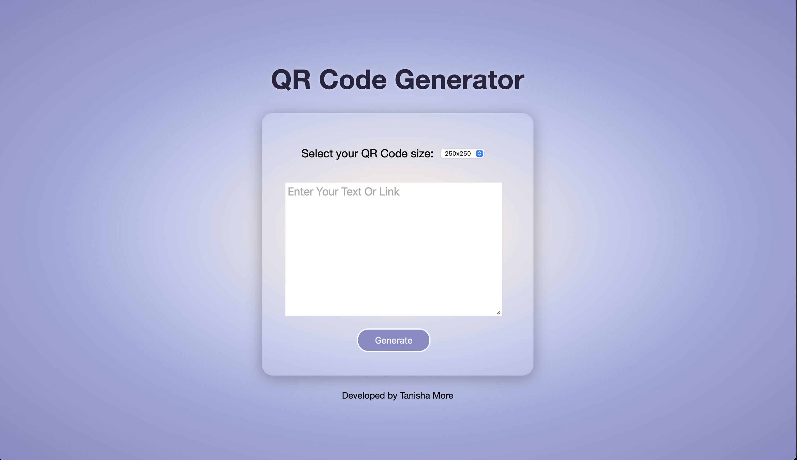
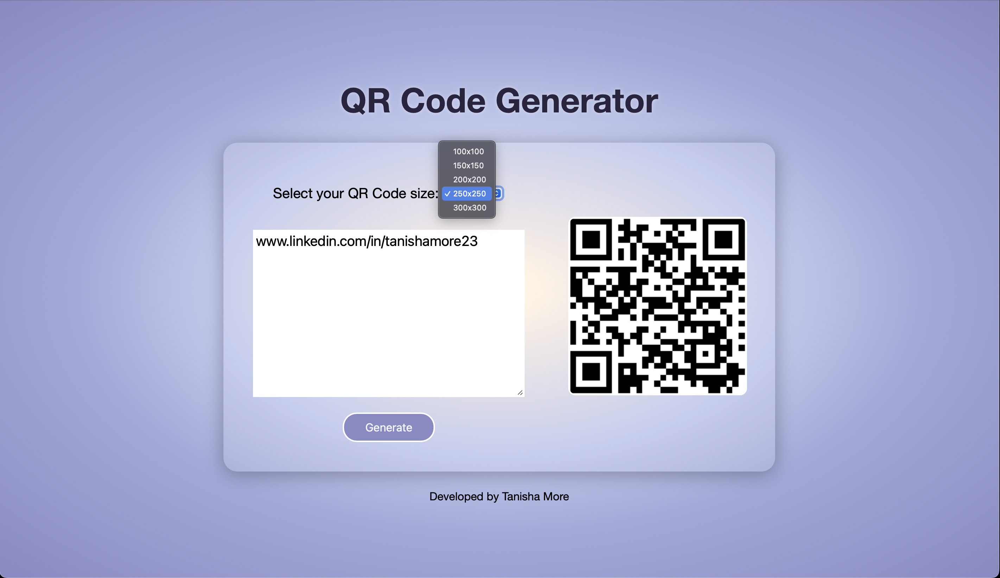

# 📱 QR Code Generator

A clean and interactive QR Code Generator built with **HTML**, **CSS**, and **JavaScript**, using the free [QRServer API](https://goqr.me/api/). Instantly convert text or URLs into QR codes with selectable sizes ranging from **100x100** to **300x300**.

---

## 🚀 Features

- 🧠 Instant QR code generation using user input  
- 🖼️ Live preview of the QR code  
- 📏 Multiple size options (100x100 to 300x300)  
- 🎨 Glassmorphism-inspired modern UI  
- 🔁 Smooth animations and transitions

---

## 🛠️ Built With

- HTML  
- CSS  
- JavaScript  
- [QRServer API](https://goqr.me/api/) – for generating QR codes

---

## 📌 How It Works

- User selects a **QR code size** from a dropdown  
- Enters **text or link** in the textarea  
- Clicks **Generate** button  
- A QR code is generated and displayed using:  

---

## 📸 Preview

  
  
  

